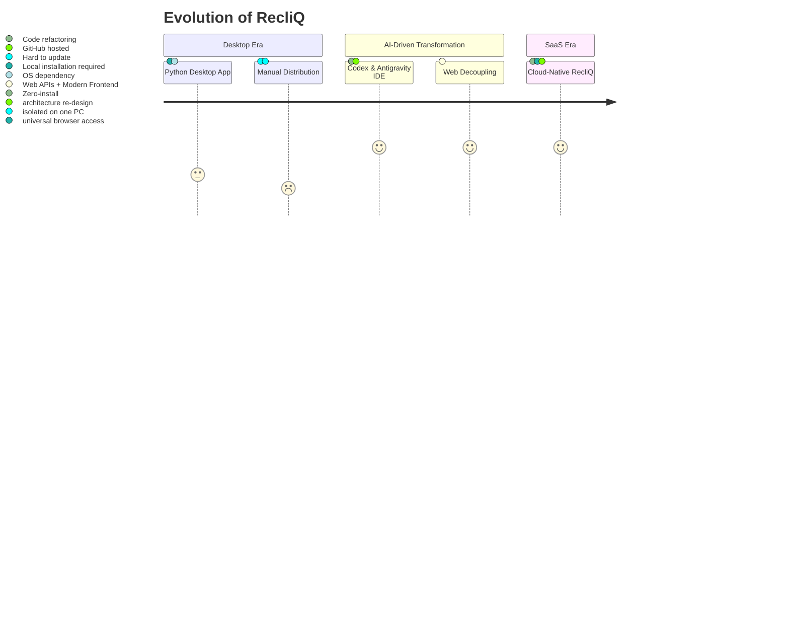
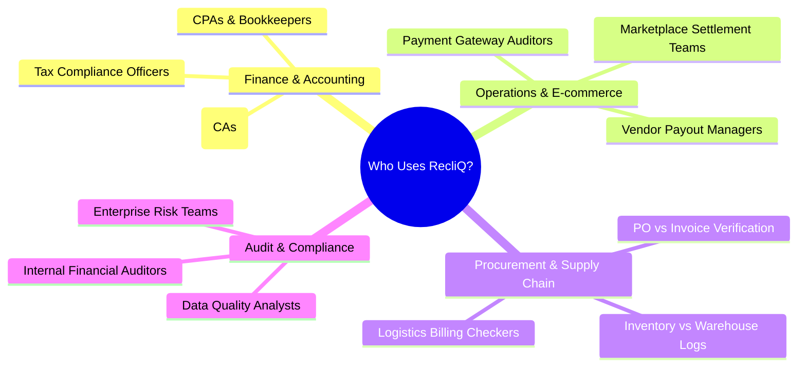

# RecliQ SaaS — Business & Non-Technical Guide

> **Tagline:** *One Click Reconciliation*  
> **Official Repository:** [https://github.com/jagdevs646/RecliQ](https://github.com/jagdevs646/RecliQ)

---

## 1. Executive Summary

**RecliQ** is an intelligent, cloud-native Software-as-a-Service (SaaS) platform engineered to automate, accelerate, and simplify data reconciliation. Whether reconciling financial ledgers, GST tax filings, vendor invoices, bank statements, or complex multi-format spreadsheets, RecliQ transforms hours of error-prone, manual spreadsheet manipulation into a seamless **one-click automated process**.

RecliQ removes all traditional friction: there is **no complex software to install**, **no registration barriers**, and **no steep learning curve**. Users simply upload their datasets via a web browser, define or auto-map their comparison rules, and receive comprehensive, audit-ready discrepancy reports within seconds.

---

## 2. The Origin Story: From Desktop Software to Cloud SaaS

### The Initial Prototype: "RecliQ Desktop"
The journey of RecliQ began with a desktop software application built using Python (wxPython/Tkinter). While the desktop version was functional and demonstrated the power of automated reconciliation logic, it faced significant real-world constraints:
- **System Installation Requirements:** Every team member had to install Python runtimes or bulky executable bundles on their local machines.
- **Operating System Incompatibilities:** Running the app across Windows, macOS, or Linux required separate builds, patches, and configurations.
- **Collaboration Bottlenecks:** Files and outputs were locked inside individual computers, making team reviews and multi-device access difficult.
- **Update Distribution Lag:** Any new matching algorithm or bug fix required distributing an entirely new installer to all users.

### The Transformation with Codex & Antigravity IDE
To unlock the true potential of the application, the author embarked on converting the desktop tool into an accessible, enterprise-grade web application. 

Using **AI-powered development with Codex** and the **Antigravity IDE**, the core matching algorithms, invoice merging logic, and report-generation pipelines were re-architected from the ground up:
1. **Separation of Logic & UI:** The desktop GUI components were decoupled from the mathematical reconciliation engine.
2. **Modern Web Re-engineering:** The user interface was rebuilt into a modern, responsive single-page web application (SPA), while the backend was structured into high-performance asynchronous microservices.
3. **Continuous Iteration:** Day by day, with continuous refinements assisted by Antigravity and Codex, the platform evolved into a full-featured, zero-install SaaS platform now hosted and maintained on GitHub.



---

## 3. Why RecliQ Was Created & Problems It Solves

### The Real-World Problem: "Spreadsheet Hell"
In modern organizations, data lives in multiple disparate systems: ERPs, CRM databases, accounting portals (like Tally, SAP, QuickBooks), bank portals, and government tax databases (like GSTN). Periodically, finance and operations teams must compare two sets of records to ensure they match.

Traditionally, this meant:
1. **Manual VLOOKUP & Excel Formulas:** Writing brittle formulas that break if column orders change or row formats differ.
2. **Hundreds of Lost Hours:** Highly paid accountants and analysts spending days cross-referencing row by row.
3. **Severe Human Errors:** Typos, minor spelling variations ("ABC Pvt Ltd" vs. "ABC Private Limited"), floating-point currency differences, and date format mismatches leading to missed discrepancies.
4. **GST & Tax Compliance Risks:** Failing to reconcile purchase registers with government tax portals (GSTR-2B) leads to lost Input Tax Credit (ITC), cash flow penalties, and legal notices.

### How RecliQ Solves These Problems

| Traditional Manual Reconciliation | RecliQ Automated SaaS |
| :--- | :--- |
| **Hours or Days** of manual spreadsheet work. | **Seconds** with one-click automated execution. |
| Breaks on minor spelling typos or format changes. | **Intelligent Fuzzy Matching** accommodates text variations & format differences. |
| Rigid column structure required. | **Universal Mapping** supporting vertical, horizontal, and multi-key mappings. |
| Hard-to-trace discrepancies across large workbooks. | **Color-Coded Multi-Sheet Excel Reports** with full audit logs and severity levels. |
| Complex local installations and software licenses. | **Instant Browser Access** — open the link and start reconciling. |

---

## 4. Who Can Use RecliQ? (Target Personas)

RecliQ is built for anyone whose workflow involves comparing and verifying tabular data:



1. **Chartered Accountants (CAs), CPAs & Tax Consultants:**
   - Instantly reconcile client purchase registers with GST portal data (GSTR-2B / GSTR-2A).
   - Identify uncredited tax amounts, duplicate invoices, and vendor mismatches before filing.
2. **Finance & Accounts Payable (AP) Teams:**
   - Verify vendor invoices against Purchase Orders (POs) and Good Receipts Notes (GRNs).
   - Ensure accurate payments without double-billing or value discrepancies.
3. **E-Commerce & Operations Teams:**
   - Reconcile internal sales logs against Amazon, Flipkart, Shopify, or payment gateway (Stripe, Razorpay, PayPal) settlement sheets.
4. **Banking & Audit Professionals:**
   - Run daily or monthly ledger vs. bank statement reconciliations with custom tolerance levels.
5. **Business Owners & SMEs:**
   - Achieve enterprise-level financial accuracy without needing costly ERP custom setups.

---

## 5. Key Business Benefits & Operational Efficiency

- **🚀 95%+ Reduction in Processing Time:** Tasks that previously took an entire workday are completed before your coffee gets cold.
- **🎯 Elimination of Human Error:** Algorithmic matching tests exact matches, fuzzy similarities, date alignments, and numerical differences with mathematical precision.
- **💰 Financial Risk Mitigation:** Prevents revenue leakage, duplicate payments to vendors, and loss of tax credits.
- **📊 Executive-Ready Reporting:** Instantly outputs professional Excel files formatted with executive summary dashboards, discrepancy breakdowns, and side-by-side mismatch logs.
- **🔒 Privacy & Isolation:** Every session is isolated with unique anonymous session tokens, ensuring data confidentiality.

---

## 6. How It Works in 5 Simple Steps


1. **Upload Datasets:** Drag and drop your two Excel (`.xlsx`, `.xls`) or CSV files into the web application.
2. **Choose Orientation & Columns:** RecliQ automatically reads available columns, supporting both standard vertical tables and transposed horizontal layouts.
3. **Define Match Keys:** Select the primary matching identifiers (e.g., Invoice Number, Order ID, Transaction Reference) and comparison columns (Amount, Date, Tax, Vendor).
4. **Run Engine:** RecliQ processes the reconciliation in the background while displaying real-time progress indicators.
5. **Review & Download:** Inspect visual summaries on the interactive web dashboard or download a formatted, multi-tab Excel workbook with highlighted differences.

---

## 7. How to Access & Use the Application

- **Official GitHub Repository:** [https://github.com/jagdevs646/RecliQ](https://github.com/jagdevs646/RecliQ)
- **Deployment Status:** RecliQ is pre-configured for instant cloud deployment on platforms like Render, Vercel, and Azure Container Apps, as well as local execution via Docker.
- **Quick Run locally:**
  ```bash
  git clone https://github.com/jagdevs646/RecliQ.git
  cd RecliQ
  docker compose up --build
  ```
  *Open your browser and navigate to `http://localhost:5173` to start reconciling.*
