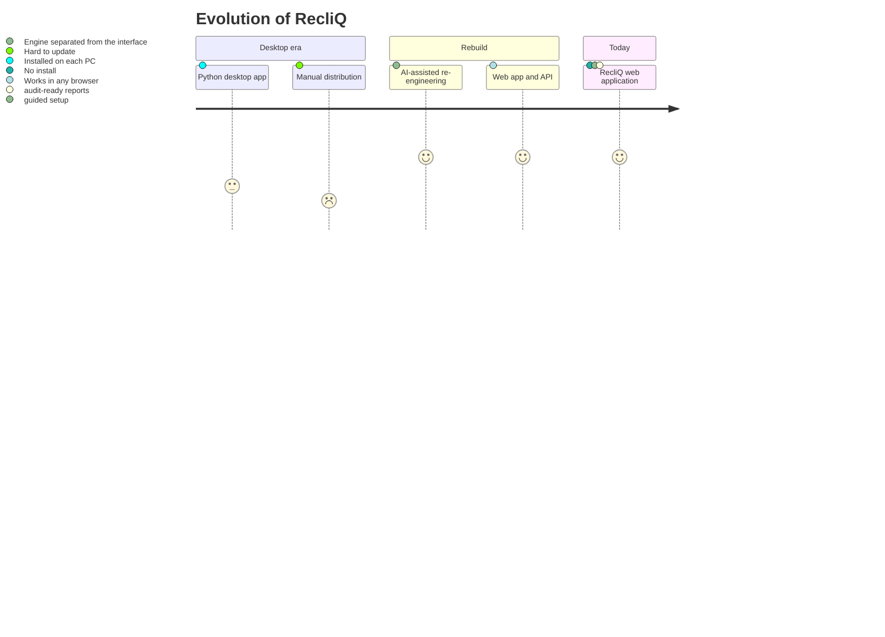
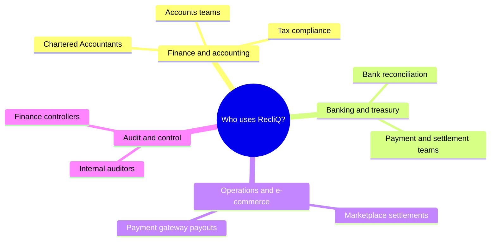

# RecliQ — Business & Non-Technical Guide

> **Tagline:** *One Click Reconciliation*
> **Repository:** [https://github.com/jagdevs646/RecliQ](https://github.com/jagdevs646/RecliQ)
> **Owner:** Jagdev Singh. RecliQ is proprietary software; see [LICENSE](../LICENSE).

---

## 1. Summary

**RecliQ** compares two sets of financial records and tells you, record by record, what matches, what differs and what is missing on either side. Typical uses are books against a bank statement, a purchase register against GSTR-2B, a ledger against a vendor statement, or sales against a payment gateway's settlement report.

It runs in a web browser. There is nothing to install and no account to create: you upload the two files, tell RecliQ how to recognise the same record in both, and download an Excel report that is ready for review and audit.

---

## 2. The origin story: from desktop software to a web application

### The first version: RecliQ Desktop
RecliQ began as a desktop application written in Python (wxPython). Its matching logic worked well, but the desktop form held it back:
- **Installation on every machine**, with Python or a large installer on each computer.
- **Separate builds for each operating system.**
- **Files and results stuck on one computer**, which made team review hard.
- **Every fix needed a new installer** sent to every user.

### The rebuild with AI-assisted development
The author rebuilt RecliQ as a web application with AI-assisted development (Codex and the Antigravity IDE at first, and later Claude Code):
1. **Logic separated from the screen.** The matching engine was taken out of the desktop interface so it could run on a server.
2. **A modern web app.** The interface was rebuilt as a browser application talking to a web API.
3. **Steady improvement.** Features were added step by step: more file formats, several sheets per run, smarter matching, tolerances, saved setups, learning from reviewers and a full audit trail.

```mermaid
journey
    title Evolution of RecliQ
    section Desktop era
      Python desktop app: 3: Installed on each PC
      Manual distribution: 2: Hard to update
    section Rebuild
      AI-assisted re-engineering: 5: Engine separated from the interface
      Web app and API: 5: Works in any browser
    section Today
      RecliQ web application: 5: No install, guided setup, audit-ready reports
```

---

## 3. The problem RecliQ solves

Finance teams regularly compare records from different systems: accounting software (Tally, SAP, QuickBooks), bank portals, marketplaces and the GST portal. Done by hand, this means:

1. **VLOOKUPs and formulas** that break when columns move or formats change.
2. **Days of row-by-row checking** by skilled staff.
3. **Missed differences** caused by small variations: "ABC Pvt Ltd" against "ABC Private Limited", a reference with a prefix, a date written differently, a few rupees of rounding.
4. **Compliance risk**: an unreconciled purchase register against GSTR-2B can mean lost input tax credit.

| Doing it by hand | With RecliQ |
| :--- | :--- |
| Hours or days of spreadsheet work | A guided setup, then the run takes seconds to minutes |
| Breaks on spelling, spacing and format differences | Names, references and dates are compared the way a person would read them |
| One layout, one sheet at a time | Several workbooks and sheets in one run, each with its own rules |
| Differences hard to trace or explain | An Excel report with a sheet per outcome and a comment on every decision |
| Rules rebuilt every month | Saved setups, re-runs with changed rules, and rules that clear recurring items |

---

## 4. Who uses RecliQ

```mermaid
mindmap
  root((Who uses RecliQ?))
    Finance and accounting
      Chartered Accountants
      Accounts teams
      Tax compliance
    Banking and treasury
      Bank reconciliation
      Payment and settlement teams
    Operations and e-commerce
      Marketplace settlements
      Payment gateway payouts
    Audit and control
      Internal auditors
      Finance controllers
```

1. **Chartered Accountants and tax consultants**: reconcile a client's purchase register with GSTR-2B, spot missing or mismatched invoices before filing.
2. **Accounts teams**: books against bank statements every month, with bank charges and similar items cleared automatically.
3. **Accounts payable**: vendor statements against the ledger; invoices against purchase orders.
4. **E-commerce and operations**: internal sales against Amazon, Flipkart, Shopify or payment gateway (Razorpay, Stripe, PayPal) settlements.
5. **Auditors and controllers**: a documented, repeatable reconciliation with an audit trail of who did what.

---

## 5. How it works: six steps

```mermaid
flowchart LR
    A["1. Upload files"] --> B["2. Pair sheets"]
    B --> C["3. Matching key"]
    C --> D["4. Map columns"]
    D --> E["5. Report setup"]
    E --> F["6. Run"]
```

1. **Upload files.** Excel, CSV or text files, tables inside PDF or Word documents, bank statements in MT940, BAI2 or CAMT.053 format, or GSTR-2B downloaded from the GST portal. You can add more than one workbook on each side.
2. **Pair sheets.** Choose which sheet is compared with which. Each pair is reconciled on its own.
3. **Matching key.** Choose the column (or columns) that identify the same record in both files, such as an invoice number or a UTR. RecliQ suggests likely keys. You can also require other columns to agree, and add extra passes that pair leftover records by amount and date when there is no common reference.
4. **Map columns.** Choose the fields to compare (amount, date, narration and so on). A search box helps with long header lists. Here you can also clean values first (remove a prefix, turn debit and credit into one amount, round), and set **tolerances**: differences small enough to accept, such as ₹5, 1%, 3 days, or narration that is 75% similar.
5. **Report setup.** Choose which extra columns appear in the report.
6. **Run.** RecliQ first checks the data (blank keys, text in amount columns, keys that barely overlap) and tells you before anything runs. Then it reconciles and shows progress.

---

## 6. What you get

### The results dashboard
- Counts for each outcome: fully matched, values differ, only in one file, matches to confirm, several possible matches, auto-resolved.
- A preview of every list, with a filter. Columns can be widened and long comments wrapped.
- **Matches to confirm**: where RecliQ found a likely but not certain match (a similar key, or an amount and date without a reference), you confirm or reject it with one click.

### The Excel report
| Sheet | Shows |
|---|---|
| Summary | Totals, the rules used and what each outcome means |
| Differences | Matched records where a compared field differs, with the difference |
| Only in File 1 / Only in File 2 | Records with no partner on the other side |
| Match Review | Likely matches to confirm and records with several candidates |
| Matched | Records that agree, including those accepted within your tolerances, with the reason |
| Checks | Control totals showing that every record is accounted for |
| Sheet Rules | The setup of each sheet pair and its results |
| Auto-resolved | Exceptions cleared by your rules, with the rule, reason code and GL account |

You can also download a customised version with only the sheets you need and your preferred date and number formats.

### Change and repeat
- **Change rules and run again**: open a finished run with its files and rules already loaded, adjust anything (a key, a mapping, a tolerance) and run again. Each run is kept separately, so you can compare.
- **Saved setups**: save the rules once and run them on next month's files; RecliQ matches the new files' sheets and columns to the saved ones and asks only when it is unsure.

---

## 7. Learning and control

- **Name aliases.** When reviewers confirm the same pair (for example "IBM" and "International Business Machines") in more than one reconciliation, RecliQ suggests remembering it. It is used only after someone approves it.
- **Learning from decisions.** A pairing a reviewer rejected is never proposed again. RecliQ shows how often each matching method is confirmed, so teams can see which ones to trust.
- **Auto-resolution rules.** Describe items your team clears the same way every period, such as bank charges below ₹500 or TDS, with a GL account. Matching exceptions are labelled automatically and listed separately. Rules can be tested on an earlier run before saving, and RecliQ suggests rules for wording that keeps recurring.
- **Audit log.** Every upload, run, decision, rule change, download and deletion is recorded, with a tamper check. It can be exported.
- Nothing is accepted silently: likely matches need confirmation, aliases need approval, and tolerances write their reason into the report.

---

## 8. Benefits

- **Time**: work that takes hours by hand becomes a short setup and a run, and repeat reconciliations reuse the setup.
- **Accuracy**: the same rules are applied to every record, and every decision is explained.
- **Fewer financial risks**: duplicates, missing entries and lost tax credit are easier to catch.
- **Ready for review**: the report is structured for managers and auditors, with totals that reconcile.
- **Privacy**: each browser session sees only its own files and results.

---

## 9. Access and ownership

- **Repository:** [https://github.com/jagdevs646/RecliQ](https://github.com/jagdevs646/RecliQ). The code is visible for reference only; using, copying or deploying it needs written permission from the owner (see [LICENSE](../LICENSE)).
- **Hosting:** RecliQ is prepared for Azure Container Apps, and can run on a single computer with Docker. Technical setup is described in [installation.md](installation.md) and [azure-deployment.md](azure-deployment.md).
