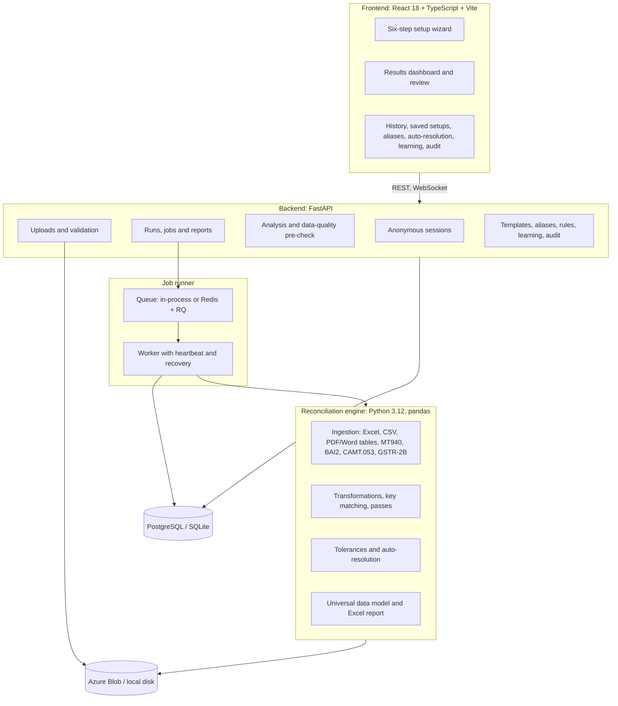
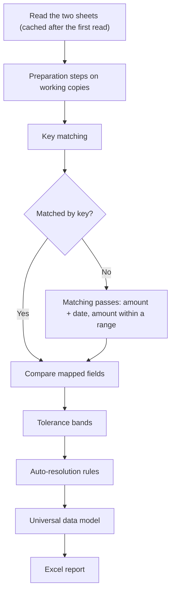

# RecliQ — Technical Architecture & Engineering Guide

> **Project:** RecliQ (web application)
> **Repository:** [https://github.com/jagdevs646/RecliQ](https://github.com/jagdevs646/RecliQ) (proprietary; see [LICENSE](../LICENSE))
> **Origin:** rebuilt from a Python desktop application with AI-assisted development

---

## 1. System overview

RecliQ is a reconciliation service: a React single-page app, a FastAPI backend, a durable job runner and a pandas-based matching engine. Records live in PostgreSQL (SQLite for local work) and files in Azure Blob Storage (local disk for development). Visitors are identified by an anonymous session, and everything they create is scoped to it.

---

## 2. Engineering origin

The first RecliQ was a wxPython desktop application. Its matching worked, but the interface and the data processing were tangled together, large files froze the window, and every user needed a local install.

The rebuild separated the two:
1. **The engine became a library.** Matching, invoice merging and report writing (`matchers.py`, the generic and GST engines) were moved out of the GUI into code with no interface dependencies.
2. **A typed contract.** Pydantic schemas define the plan (file pairs and sheet rules), jobs, previews and reports; the TypeScript types mirror them.
3. **Background execution.** Runs moved off the request path into a job queue with progress reporting.
4. **A new frontend.** A React and TypeScript single-page app with its own design tokens and no UI framework.

Since then the engine has been extended well beyond the desktop version: several sheets and workbooks per run, keyless matching passes, preparation steps, company-name normalization, tolerances after matching, learning from reviewers, auto-resolution rules, bank statement and GST return formats, and an append-only audit log.

---

## 3. Technology stack

| Layer | Technology | Purpose |
| :--- | :--- | :--- |
| Frontend | React 18, TypeScript 5.5 | Component UI with compile-time checks |
| Build and tests | Vite 7, Vitest 4, pnpm 9 | Dev server, production build, unit tests |
| Icons and styling | Lucide, plain CSS with design tokens, Inter font | Light, responsive, accessible UI |
| API | FastAPI 0.141, Pydantic Settings, Uvicorn | Async REST API with OpenAPI docs at `/docs` |
| Data processing | pandas 2.2 | Tabular operations |
| Fuzzy matching | RapidFuzz 3.9 | Token and Levenshtein similarity |
| File reading | openpyxl, xlrd, pdfplumber, python-docx, defusedxml | Excel, PDF and Word tables, safe XML for CAMT.053 |
| Reports | openpyxl, XlsxWriter | Multi-sheet Excel output |
| Database | SQLAlchemy 2.0, Alembic, psycopg 3 | ORM and migrations; PostgreSQL 16 or SQLite |
| Jobs | RQ 1.16 on Redis 7, or an in-process pool | Durable background runs |
| Storage | Azure Storage Blob SDK, or local disk | Uploads, caches and reports |
| Observability | JSON logs, request IDs, Sentry | Tracing a request or run end to end |
| Delivery | Docker, GitHub Actions, Azure Container Apps | Images, CI, hosting |

---

## 4. The reconciliation engine

### 4.1 The plan

Every run is described by a **plan**: one or more file pairs, each with one or more independent sheet rules. A sheet rule holds the keys, "must also match" conditions, matching passes, column mappings, preparation steps, tolerances, date convention and name-normalization settings. The wizard, saved setups, re-runs and the API all produce this same structure (see [api.md](api.md)), and the plan is stored with the job so a run can be reproduced or reopened.

### 4.2 Processing order per sheet rule

1. **Ingestion** (`ingestion/`). Workbooks are parsed once per file and sheet and cached (the cache name includes a reader version, so changes to reading invalidate old caches). PDF tables are read from character positions: cells that overflow into a neighbouring column are split correctly, tables that continue across pages are joined, and repeated headers are dropped. MT940, BAI2 and CAMT.053 statements become Transactions and Balances sheets; GSTR-2B JSON becomes the column layout the GST reconciliation expects.
2. **Preparation** (`transformations.py`). A fixed list of operations: trim, change case, remove characters, prefixes or suffixes, replace text, strip leading zeros, keep letters and digits, invert sign, absolute value, multiply, round (half up, so 2.675 becomes 2.68), and debit/credit to a signed amount. They apply to working copies; the report shows original values.
3. **Key matching** (`matching/`, `normalization/`). Keys are compared exactly, then in a normalized form: case, spacing and punctuation removed; for company names, legal forms (Pvt/Private, Ltd/Limited), common abbreviations, honorifics (M/s) and word order are normalized, and approved aliases apply. Fuzzy similarity (RapidFuzz) runs only after these rules fail, and a fuzzy key match is never treated as exact: it becomes a **match to confirm**. "Must also match" columns can reject a key match. Pairings a reviewer rejected earlier are not proposed again.
4. **Matching passes** (`matching/pass_matcher.py`). On records still unmatched: same amount with dates within a window, or an amount within an absolute or percentage range, optionally requiring a similar narrative. A pair is made only when it is unique on both sides; otherwise the candidates are reported as "several possible matches".
5. **Field comparison** (`engine.py`). Mapped fields are compared by type: numbers by difference, dates as calendar dates (year-first always; day-first or month-first for ambiguous numeric dates, per rule), text by similarity.
6. **Tolerances** (`tolerance.py`). After matching and before the report, each difference is checked against the rule's bands: an amount, a percentage of the destination value, a number of days, or a minimum text similarity. Accepted differences are removed; a record with none left moves to Matched, and its comment explains why (for example "NARRATION is 85% similar, at least 75% required; AMOUNT differs by 3.98, within ±5"). Matches still to confirm stay in review.
7. **Auto-resolution** (`resolution.py`). The session's rules, in order, label recurring exceptions with a resolution, reason code and GL account.
8. **Report** (`universal_mapper.py`, `universal_reporter.py`). All sheet rules are merged into one data model, then written as the Summary, Differences, Only in File 1, Only in File 2, Match Review, Matched, Checks, Sheet Rules and Auto-resolved sheets. The Checks sheet proves every input record is accounted for.

### 4.3 GST reconciliation

A dedicated flow (`run_gst_reconciliation` in `reconciliation_engine/engine.py`, called through `app/reconciliation/gst.py`) merges duplicate invoice lines, compares taxable value, IGST, CGST, SGST, cess and invoice value between the purchase register and GSTR-2B, and reports mismatches, invoices present on one side only, and a confidence review of near matches.

### 4.4 Learning

Reviewers' confirm/reject decisions are stored with the method and score that proposed the match. RecliQ reports, per method and score band, the share of proposals confirmed and a conservative estimate (lower bound of the 95% Wilson interval), and turns that into suggestions. Learning never confirms a match by itself: aliases need approval, and rules need a person to create them.

---

## 5. API and data flow

The full endpoint list is in [api.md](api.md). A run follows this path:

1. **Upload** (`POST /api/files/upload`): content is checked against the extension, size and row limits are enforced while streaming, and the file's SHA-256 is recorded in the audit log.
2. **Set up**: sheets and headers are read (`/files/{id}/metadata`, `/files/{id}/columns`), and `POST /api/analysis/` suggests keys and column pairs.
3. **Pre-check** (`POST /api/analysis/precheck`): the sheets are read exactly as the run will read them; blockers must be fixed and warnings confirmed.
4. **Start** (`POST /api/reconciliation/generic`): the plan is validated, stored with a new job, and the job is queued.
5. **Run**: a worker claims the job with a conditional update, refreshes a heartbeat, and reports progress (`GET /api/jobs/{id}`, `WS /api/jobs/{id}/ws`).
6. **Review**: `GET /api/reports/job/{id}/summary` and `/preview` feed the dashboard; `/download` returns the workbook.
7. **Repeat**: `GET /api/jobs/{id}/plan` returns the stored plan and files for "Change rules and run again".

---

## 6. Data, jobs and reliability

- **Database.** Files, jobs and their history, reports, saved setups and versions, aliases and decisions, auto-resolution rules and versions, and the audit log. Alembic migrations run on start in containers.
- **Durable jobs.** The job row is the source of truth. With Redis, workers run separately (`python -m app.jobs.worker`); without it, a thread pool in the API runs them. A sweeper re-queues runs whose heartbeat has stopped, up to `JOB_MAX_ATTEMPTS`, then fails them with an explanation. Infrastructure errors are retried; data errors are not.
- **Retention.** Each session keeps its 20 most recent runs; older ones are removed with their reports.
- **Timestamps.** Stored in UTC and returned with an offset, so browsers show local time correctly.

---

## 7. Security and compliance

- **No secrets in the repository.** Configuration comes from environment variables and a secret store; CI scans the full history with gitleaks.
- **Upload safety.** Content sniffing, password-protected and ZIP-bomb detection, `defusedxml` for XML, and size and row limits.
- **Session isolation.** Every query is filtered by the session; the session cookie is HttpOnly and `Secure` over HTTPS.
- **Append-only audit log.** The ORM and database triggers refuse updates and deletes, entries are hash-chained, and `GET /api/audit/verify` detects tampering.

Details: [operations-and-security.md](operations-and-security.md).

---

## 8. Testing and delivery

- **Backend**: pytest suite in `tests/backend`, run against SQLite locally; CI also runs the migrations on PostgreSQL and checks the audit log stays append-only.
- **Frontend**: TypeScript type-check, Vitest unit tests for the plan logic, and a production build.
- **CI** (`.github/workflows/ci.yml`): secret scan, both test suites, dependency audits (`pip-audit`, `pnpm audit`) and all Docker image builds on every push.
- **Deployment**: Docker Compose for a local production-like stack ([installation.md](installation.md)); Azure Container Apps through `scripts/deploy-azure.ps1` ([azure-deployment.md](azure-deployment.md)).

---

## 9. Ownership

RecliQ is proprietary software owned by Jagdev Singh (@jagdevs646). The source is visible for reference only; it may not be copied, modified, distributed or used without written permission. See [LICENSE](../LICENSE).
