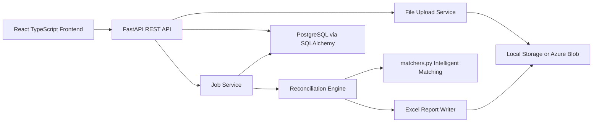

# Architecture

RecliQ Single-User MVP separates the application into a UI layer, an API/job orchestration layer, storage/database infrastructure, and the preserved reconciliation engine. Authentication is intentionally absent during the MVP phase.

## Request Flow

1. The frontend opens directly to Dashboard.
2. The user uploads File 1 and File 2 to `/api/files/upload`.
3. The frontend asks `/api/files/{id}/columns` for available headers, with vertical or horizontal orientation.
4. The user chooses primary matching columns and creates rule mappings.
5. The frontend submits `/api/reconciliation/generic` or `/api/reconciliation/gst`.
6. The backend assigns the job to the current anonymous session, runs the engine in a background task, writes an Excel report under that session's storage directory, and updates job status.
7. The frontend polls `/api/jobs/{id}` and downloads the workbook from `/api/reports/job/{id}/download`.

## Engine Boundary

The backend service layer does not implement matching decisions. It prepares files and invokes:

- `app.reconciliation.generic.run_generic_reconciliation`
- `app.reconciliation.gst.run_gst_reconciliation`
- `app.reconciliation.matchers.compare_values`

This keeps future UI/API changes separate from reconciliation accuracy changes.
