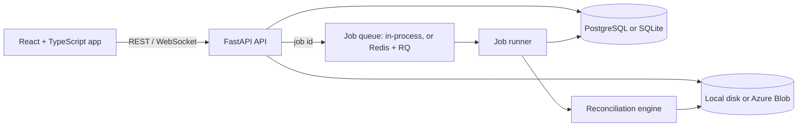
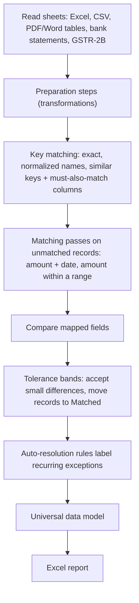

# Architecture

RecliQ has four parts: a React single-page app, a FastAPI backend, a job runner, and the reconciliation engine. The backend stores its records in a SQL database and its files (uploads and reports) in a storage backend. There are no user accounts; every record belongs to an anonymous browser session.

```mermaid
flowchart LR
    Browser["React + TypeScript app"] -->|REST / WebSocket| API["FastAPI API"]
    API --> DB[("PostgreSQL or SQLite")]
    API --> Storage[("Local disk or Azure Blob")]
    API -->|job id| Queue["Job queue: in-process, or Redis + RQ"]
    Queue --> Worker["Job runner"]
    Worker --> Engine["Reconciliation engine"]
    Engine --> Storage
    Worker --> DB
```

## Components

| Component | Where | Responsibility |
|---|---|---|
| Frontend | `frontend/src` | The six-step setup wizard, results dashboard, history, saved setups, aliases, auto-resolution, learning and audit pages. `src/lib` holds plan building and validation, free of React and unit-tested |
| API | `backend/app/api/routes` | Sessions, uploads, analysis and pre-check, starting runs, job status, reports, saved setups, aliases, rules, learning, audit |
| Services | `backend/app/services` | Orchestration: runs, templates, pre-check, aliases, auto-resolution, learning, audit, retention |
| Job runner | `backend/app/jobs` | Queue, worker, and recovery of runs whose worker stopped |
| Engine | `backend/app/reconciliation_engine` | Reading files, preparing values, matching, tolerances, auto-resolution and the Excel report |
| Entry points | `backend/app/reconciliation` | The generic and GST entry points and the original value matchers (`matchers.py`) |
| Storage | `backend/app/storage` | Local and Azure Blob implementations behind one interface |

## A run from start to finish

1. **Upload.** The browser uploads each file to `POST /api/files/upload`. The backend checks the content against the extension and the size and row limits, stores the file under the session, records its SHA-256 in the audit log, and starts reading it in the background.
2. **Set up.** The wizard reads sheets and headers (`/files/{id}/metadata`, `/files/{id}/columns`) and asks `POST /analysis/` for key and column suggestions. The user builds a **plan**: file pairs, each with one or more sheet rules (keys, conditions, passes, mappings, preparation steps, tolerances, date format).
3. **Check.** `POST /analysis/precheck` reads the sheets exactly as the run will and reports blockers and warnings. Warnings must be confirmed, and the confirmation is stored with the run.
4. **Queue.** `POST /reconciliation/generic` validates the plan, stores it with the job (`settings_json`) and queues the job.
5. **Run.** A worker claims the job and runs every sheet rule (see the next section), keeping a heartbeat. Progress is visible through `GET /jobs/{id}` and the `/jobs/{id}/ws` WebSocket.
6. **Report.** Results from all rules are merged into one data model and written as an Excel workbook (one per file pair when there are several), and the report data is stored separately for previews and custom reports.
7. **Review.** The results page shows counts and previews. Reviewers confirm or reject proposed matches, which feeds learning and alias suggestions. **Change rules and run again** reopens the stored plan (`GET /jobs/{id}/plan`) in the wizard and starts a new run on the same files.

## Inside the engine (per sheet rule)

```mermaid
flowchart TD
    Read["Read sheets: Excel, CSV, PDF/Word tables, bank statements, GSTR-2B"] --> Prep["Preparation steps (transformations)"]
    Prep --> Key["Key matching: exact, normalized names, similar keys + must-also-match columns"]
    Key --> Passes["Matching passes on unmatched records: amount + date, amount within a range"]
    Passes --> Compare["Compare mapped fields"]
    Compare --> Tolerance["Tolerance bands: accept small differences, move records to Matched"]
    Tolerance --> Resolve["Auto-resolution rules label recurring exceptions"]
    Resolve --> Model["Universal data model"]
    Model --> Report["Excel report"]
```

- **Reading** (`ingestion/`): workbooks are parsed once and cached. PDF tables are read cell by cell, joined across pages, and header rows are detected. Bank statement formats are turned into Transactions and Balances sheets.
- **Preparation** (`transformations.py`): a fixed list of steps (trim, remove prefixes, invert signs, debit/credit to a signed amount, round half up, and more) applied to working copies. The report keeps the original values.
- **Key matching** (`matching/`, `normalization/`): keys are compared after removing spacing, case and punctuation, with company-name normalization (legal forms, abbreviations, word order) and approved aliases. Near matches become "matches to confirm". Reviewers' rejected pairings are not proposed again.
- **Passes** (`matching/pass_matcher.py`): pair records the key did not find, only when the pairing is unique on both sides.
- **Tolerances** (`tolerance.py`): after matching, differences within a band (an amount, a percentage of the destination value, a number of days, or a text similarity) are accepted. The report says why in the comment.
- **Auto-resolution** (`resolution.py`): the session's rules, in order, label exceptions such as bank charges; the report lists them on the Auto-resolved sheet.
- **Report** (`universal_mapper.py`, `universal_reporter.py`): builds the Summary, Differences, Only in File 1, Only in File 2, Match Review, Matched, Checks, Sheet Rules and Auto-resolved sheets.

## Data

- **Database**: files, jobs and their history, reports, saved setups and their versions, aliases and decisions, auto-resolution rules and the audit log. Migrations are managed with Alembic (`backend/alembic`). The audit log is append-only: the ORM and database triggers refuse updates and deletes.
- **Storage**: uploads, parsed-sheet caches, reports and report data, under a per-session folder.
- **Retention**: each session keeps its 20 most recent runs; older runs are removed with their reports, and their uploads when no remaining run uses them.

## Design choices

- **The plan is the contract.** The wizard, saved setups, re-runs and the API all produce the same plan format, and the engine only reads plans.
- **Nothing is accepted silently.** Near matches need confirmation, aliases need approval, learning never confirms matches by itself, and tolerances write their reason into the report.
- **Jobs survive restarts.** The database row is the source of truth; a sweeper re-queues runs whose worker stopped, up to a retry limit.

More detail: [TECHNICAL_ARCHITECTURE_GUIDE.md](TECHNICAL_ARCHITECTURE_GUIDE.md) and [operations-and-security.md](operations-and-security.md).
